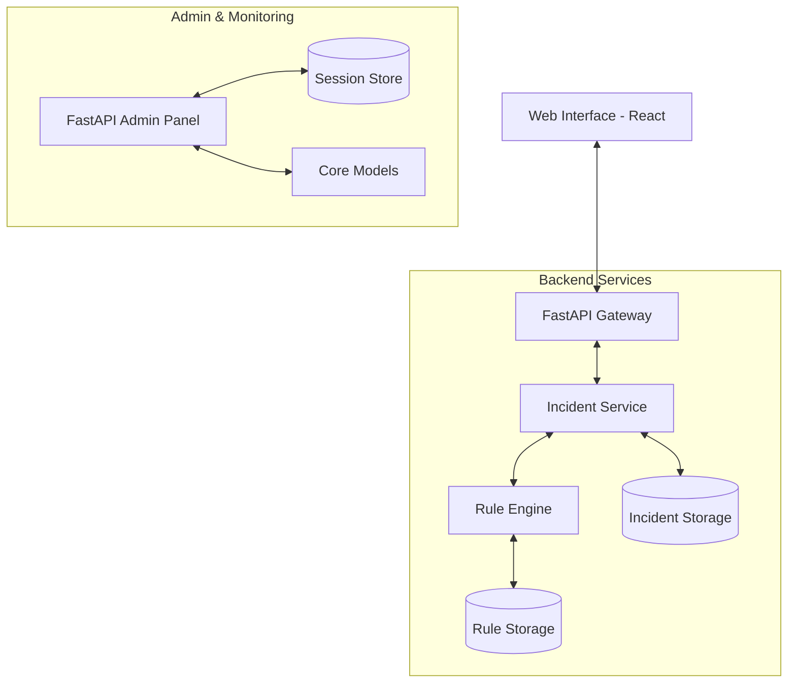

# System Design & Architecture

## High-Level Architecture
The **ERP Incident Triage Portal** follows a modern full-stack architecture with a decoupled frontend and backend. It leverages a rule-based engine for automated incident enrichment.

## Technology Choices & Rationale

| Layer | Technology | Rationale |
| :--- | :--- | :--- |
| **Backend** | FastAPI | High performance, automatic OpenAPI documentation, and asynchronous support. |
| **ORM** | Tortoise ORM | Async ORM with a clean API, ideal for FastAPI. |
| **Database** | SQLite (Local) | Zero-configuration, perfect for development and lightweight environments. |
| **Admin** | FastAPI Admin | Quick boilerplate for model management (curated for Django-like experience). |
| **Frontend** | React + Vite | Fast development cycle (HMR), component-based architecture. |
| **Icons** | Lucide React | Clean, lightweight icon set. |
| **State** | React Hooks | Simplified state management (useState/useEffect) sufficient for current scale. |

## System Flow

1. **Incident Intake**: User submits a report via the `IncidentForm`.
2. **Persistence**: The backend saves the raw incident data.
3. **Auto-Enrichment**:
    - The `EnrichmentService` fetches active rules.
    - Rules are matched against the incident's module and description tokens.
    - Severity, category, and summaries are updated automatically.
4. **Triage Dashboard**: The `IncidentTable` fetches enriched data, providing P1 alerts and filtered views.
5. **Status Management**: Support agents update incident status (e.g., from `New` to `In Progress`) via the detailed view.

### Non-Technical (Business) Assumptions
1. **Standardized Environments**: The portal assumes a dual-environment landscape (Production vs. Test) is sufficient for all business units.
2. **Manual Verification**: While the rule engine automates primary triage (severity/category), it is assumed that a human agent performs the final verification and status transition.
3. **Centralized Governance**: The design assumes a centralized triage model where a single dashboard serves multiple business units globally.
4. **Data Accuracy**: It is assumed that the incident description provided by the user contains sufficient descriptive tokens (keywords) for the rule engine to act upon.

## Future Improvements & Extensions

- **WebSockets**: Implement real-time dashboard updates when new incidents are enriched.
- **Audit Logs**: Track every change made to an incident (who changed status, when, etc.).
- **Advanced Rules**: Integrate a more complex expression evaluator (e.g.,Rag basaed LLM systems that can help making the rules more dynamic ).
- **Custom Admin**: Migrate from `fastapi-admin` to a custom-built React admin if specific complex UI workflows are required.
- **Reporting**: Add an analytics layer to visualize incident volume by module/severity over time.
